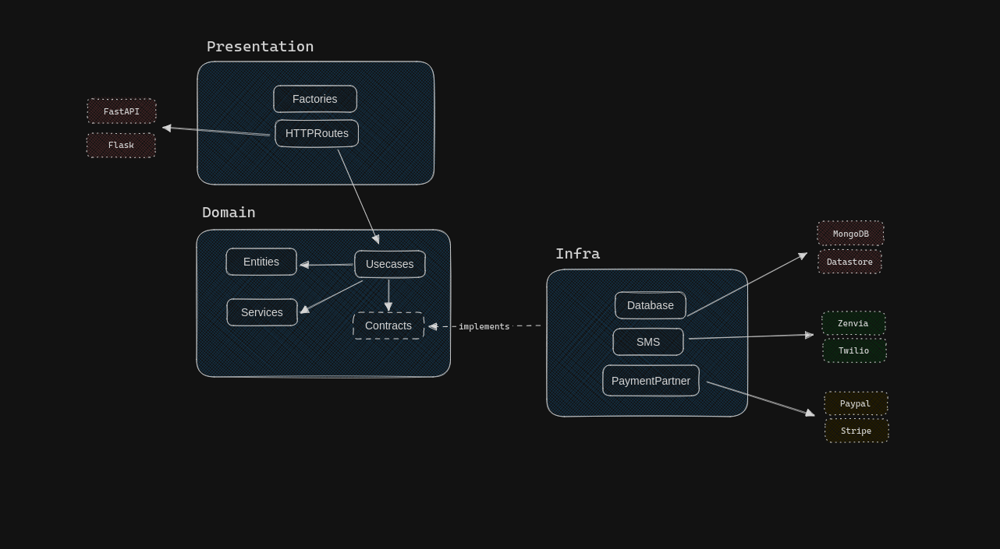

# py-awesome-template

Kickstart your Python Python 3.x project with Clean Architecture. This robust template embraces the principles of Clean Architecture. This template not only provides a well-organized folder structure but also comes pre-configured with essential tools and settings, including code styling, continuous integration, Docker support, and SonarCloud integration.

## Features

- Clean Architecture Structure: The project template follows [Uncle Bob's Clean Architecture](https://blog.cleancoder.com/uncle-bob/2012/08/13/the-clean-architecture.html) principles. The clear separation of layers ensures maintainability, testability, and scalability.

- Code Styles Pre-configuration: We've set up pylint, autopep8, flake8, and isort to help you maintain consistent and clean code.

- SonarCloud Integration: Leverage the power of SonarCloud for in-depth code analysis. Keep track of technical debt, code quality, reliability, and more.

- Continuous Integration (GitHub Actions): A robust CI pipeline is ready to check code styles, run unit tests, and perform SonarCloud scans with each push.

- Docker Support: Easily run your project locally using Docker. No hassle with dependencies; everything is containerized.

## Setup project

### Getting Started

To run the project locally, ensure you have Docker installed. If not, follow the installation [guide here](https://docs.docker.com/engine/install/).

### Sonar Config

For code analysis on each push, configure SonarCloud. Create a new project using GitHub Actions on SonarCloud. Grab the `SONAR_TOKEN` and create a secret with the same name in your GitHub repository. Update the `sonar-project.properties` file with your `sonar.projectKey` and `sonar.organization` from the SonarCloud configuration page.

> [!NOTE]
> SonarCloud is free for personal use in public repositories.

### Installing Dependencies

Manage project dependencies in the pyproject.toml file. Use `tool.poetry.dependencies` for production dependencies and `tool.poetry.group.test.dependencies` for test and development dependencies.

### Available commands

Use the following commands in the root folder with **make**:

| Command          | Description                                                                                             |
| ---------------- | ------------------------------------------------------------------------------------------------------- |
| make dev         | Run the project locally. Docker must be installed.                                                      |
| make dev-build   | Run the project locally with build. Useful after installing new dependencies. Docker must be installed. |
| make test        | Run unit tests. Ensure the Docker container is running.                                                 |
| make check-code  | Verify code syntax and styles (PEP8). Docker container must be running.                                 |
| make format-code | Format code styles (PEP8). Docker container must be running.                                            |

### Config files

| File                     | Description                                                                                  |
| ------------------------ | -------------------------------------------------------------------------------------------- |
| .coveragerc              | Define files for analysis and ignored in test coverage reports.                              |
| .env.example             | Define environment variables. Create a .env file in the project root based on .env.example.  |
| .flake8                  | Define flake8 code styles.                                                                   |
| Makefile                 | Create shortcuts for commands using make.                                                    |
| pyproject.toml           | Set project details, add dependencies, and define autopep8, pylint and isort configurations. |
| sonar-project.properties | Set the SonarCloud configurations.                                                           |
| pytest.ini               | Set pytest configurations.                                                                   |
| github/workflows/ci.yaml | Github Actions CI configuration file.                                                        |

## Architecture and Folder Structure

This template uses an architecture and folder structuring based on uncle bob's clean architecture.
The layers (folders) have the following responsibilities:

### Main

Basic settings and starting point where the "app" is created.

### Domain

The core layer housing use cases, models, entities, services (common codes), and contracts. Contracts are interfaces that abstract external libraries or services, implemented in the infrastructure layer. The domain layer should never directly access other layers but interact through interfaces using dependency injection.

### Presentation

The layer for accessing the application's use cases and exposing the application to the external world, often through HTTP/REST (e.g., FastAPI or Flask). The presentation layer utilizes the factory pattern to instantiate classes needed to execute a use case.

### Infra

Handles integrations with external APIs, libraries, or services. The integration implementation classes must adhere to contracts defined in the domain layer.

## License

This project is licensed under the MIT License - see the [LICENSE file](LICENSE) for details. You are free to use, modify, and distribute this template for commercial and non-commercial purposes.
